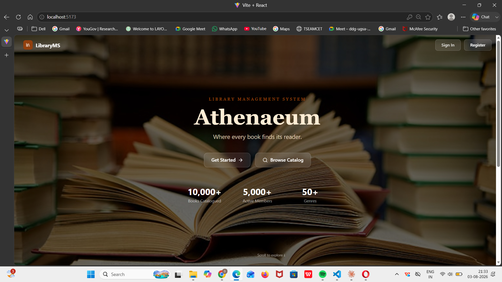
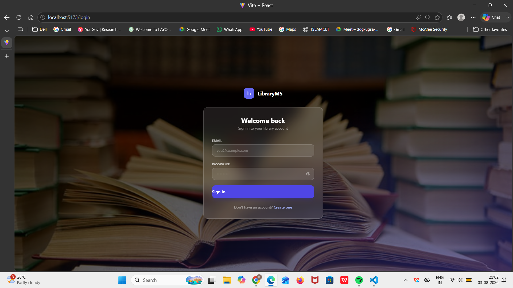
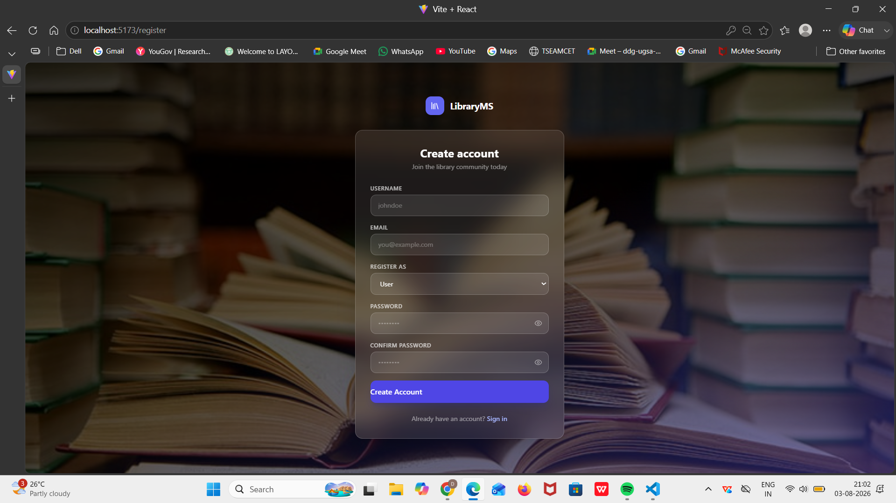
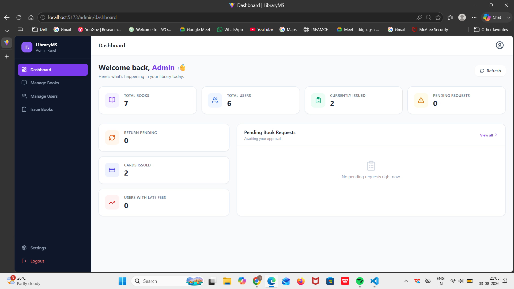
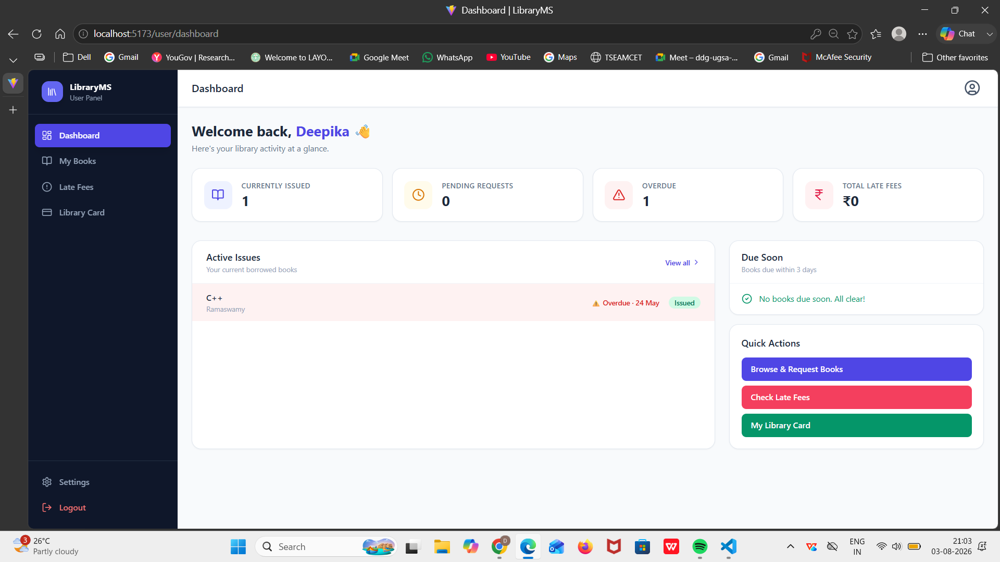
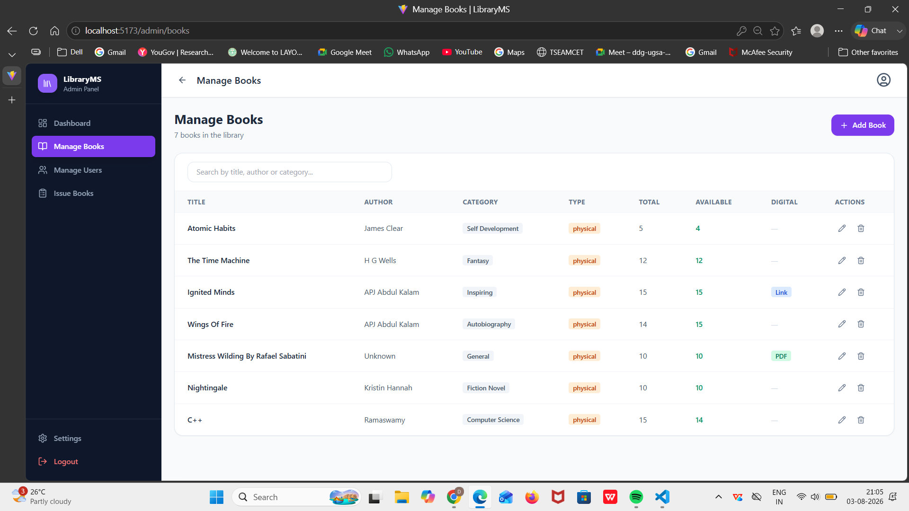
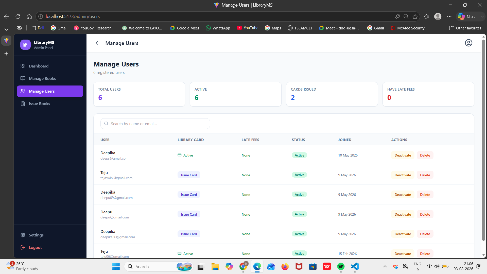
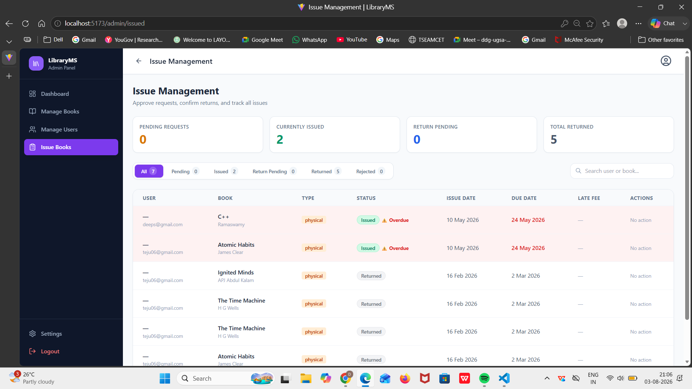

# 📚 Library Management System

A full-stack **Library Management System (LMS)** built using the **MERN Stack** that streamlines library operations through secure role-based access. The system enables administrators to manage books and users while allowing users to browse, issue, and return books through an intuitive interface.

---

## 🚀 Features

### 👨‍💼 Admin
- Secure Admin Login & Registration
- Dashboard with library overview
- Add, update, and delete books
- Manage registered users
- Approve and manage book issue requests
- Track issued and returned books

### 👨‍🎓 User
- Secure User Login & Registration
- Browse and search books
- View available books
- Issue and return books
- View issued book history
- Role-based access control

---

## 🛠️ Tech Stack

### Frontend
- React.js
- Vite
- Tailwind CSS
- React Router DOM
- Axios
- Lucide React Icons

### Backend
- Node.js
- Express.js
- JWT Authentication
- bcrypt.js

### Database
- MongoDB Atlas
- Mongoose ODM

---

## 📂 Project Structure

```
LibraryManagement/
│
├── frontend/
│   ├── src/
│   ├── public/
│   └── package.json
│
├── backendnew/
│   ├── controllers/
│   ├── middleware/
│   ├── models/
│   ├── routes/
│   ├── config/
│   └── server.js
│
├── .gitignore
└── README.md
```

---

## 🔐 Authentication

The application uses **JWT (JSON Web Token)** for secure authentication.

- User Registration
- Admin Registration
- Login Authentication
- Password Encryption using bcrypt
- Protected Routes
- Role-Based Authorization

---

## 📖 Functional Modules

### 📚 Book Management
- Add new books
- Update book details
- Delete books
- Search books
- View availability

### 👥 User Management
- Register users
- View registered users
- Manage user details

### 📄 Book Issue System
- Issue books
- Return books
- Track issued books
- Update book availability

---

## 🗄️ Database Collections

- Users
- Books
- Issues

---

## ⚙️ Installation

### Clone Repository

```bash
git clone https://github.com/Deepika471/LibraryManagement.git
```

### Navigate to Project

```bash
cd LibraryManagement
```

---

### Backend Setup

```bash
cd backendnew
npm install
npm start
```

---

### Frontend Setup

```bash
cd frontend
npm install
npm run dev
```

---

## 🔑 Environment Variables

Create a `.env` file inside the backend folder.

```env
MONGO_URI=your_mongodb_connection_string

JWT_SECRET=your_secret_key

PORT=5000
```

---

## 💻 API Endpoints

### Authentication

| Method | Endpoint | Description |
|---------|----------|-------------|
| POST | /api/auth/register | Register User/Admin |
| POST | /api/auth/login | Login User/Admin |

### Books

| Method | Endpoint | Description |
|---------|----------|-------------|
| GET | /api/books | Get All Books |
| POST | /api/books | Add Book |
| PUT | /api/books/:id | Update Book |
| DELETE | /api/books/:id | Delete Book |

### Issues

| Method | Endpoint | Description |
|---------|----------|-------------|
| POST | /api/issues | Issue Book |
| PUT | /api/issues/:id | Return Book |
| GET | /api/issues | View Issued Books |

---

## 📸 Screenshots

> Add screenshots of:
 ### Home Page

 ### Login Page

 ### Registration Page

 ### Admin Dashboard

 ### User Dashboard

 ### Manage Books

 ### Manage Users

 ### Issue Books


---

## 🎯 Future Enhancements

- Email Notifications
- Fine Calculation
- Book Reservation System
- Barcode/QR Code Integration
- Dashboard Analytics
- Book Recommendation System

---

## 📈 Project Highlights

- Full-stack MERN application
- JWT-based Authentication
- Role-Based Access Control
- RESTful API Architecture
- Responsive UI with Tailwind CSS
- MongoDB Atlas Integration
- CRUD Operations
- Secure Password Hashing using bcrypt

---

## 👩‍💻 Author

**Deepika Katika**

- GitHub: https://github.com/Deepika471
- LinkedIn: https://www.linkedin.com/in/deepika-katika-2k5

---

## ⭐ If you found this project useful, consider giving it a Star!